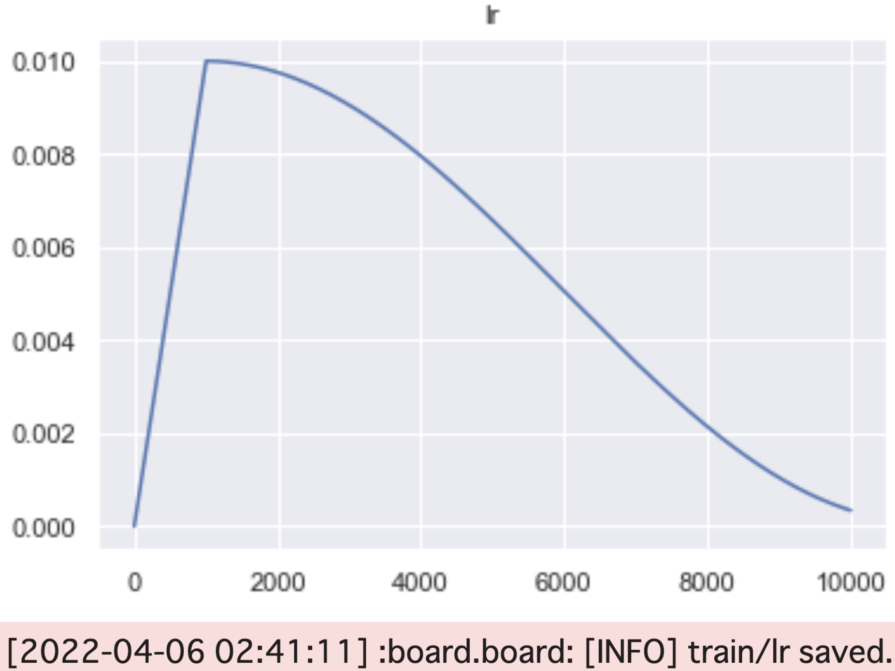

<div align="center">

<h1>Board</h1>

[](https://github.com/a5chin/awesome-board/actions/workflows/pytest.yml) [](https://github.com/a5chin/awesome-board/actions/workflows/linting.yml) [](https://img.shields.io/pypi/l/ansicolortags.svg)

[](https://www.python.org/) [](examples/classification.ipynb) [](https://numpy.org/)

</div>

## Usage

### Installation
```bash
pip install -r requirements.txt
```
or
```bash
pip install git+https://github.com/a5chin/awesome-board
```

### Example
```bash
from board import Board


board = Board("logs")
board.savefig("outputs", extension="png")
```

